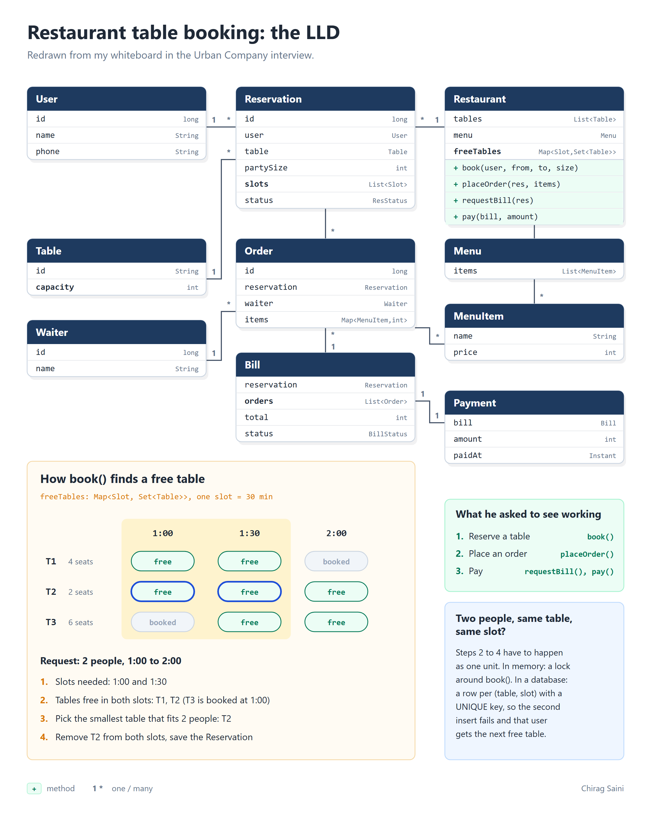

# Restaurant table booking (LLD)

A low level design for a restaurant table booking system, written up after my SDE interview at Urban Company. The interviewer asked for three things to work:

1. Users can make reservations
2. Users can place an order
3. Users can make a payment

This is plain Java 21 with no frameworks and in-memory storage, the way you'd write it in an interview, plus tests.



## Run it

```bash
./mvnw test                                        # 42 tests, including a concurrency test
java -cp target/classes com.chirag.restaurant.Main # replays the whiteboard example
```

Output of `Main`:

```
Free tables per slot:
  13:00  [T1, T2]
  13:30  [T1, T2, T3]
  14:00  [T2, T3]

Booked: Reservation#3 Chirag x2 at T2 13:00-14:00 CONFIRMED
Order 1 (Ravi): 560
Order 2 (Ravi): 240
Bill 1 total: 800
Paid 800, bill is PAID
Reservation is now COMPLETED
```

## How it's laid out

```
src/main/java/com/chirag/restaurant/
  Restaurant.java              the class a caller uses: book, cancel, placeOrder, requestBill, pay
  Main.java                    demo
  model/                       User, Table, Waiter, Menu, MenuItem, Slot, Reservation, Order, Bill, Payment
  service/
    TableAvailability.java     slot -> free tables, picks the smallest table that fits
    ReservationService.java    reserve and cancel
    OrderService.java          orders against a reservation, assigns a waiter
    PaymentService.java        one bill per visit, pay it once
  exception/
    NoTableAvailableException.java
```

## Decisions worth knowing

- **Time is split into 30 minute slots.** A booking from 1:00 to 2:00 is the slots 1:00 and 1:30. Times that aren't on the hour or half hour are rejected.
- **Smallest table that fits.** Tables are checked smallest first, so the first one that is free in every slot is the best fit. A couple won't take a table for six.
- **Check and book happen under one lock.** `TableAvailability` is synchronized. Remove that and `ConcurrentBookingTest` fails: 50 threads racing for 3 tables end up with far more than 3 bookings.
- **Reservation status moves in one direction.** `CONFIRMED -> BILLED -> COMPLETED`, or `CONFIRMED -> CANCELLED`. You can't order after the bill is out, and you can't pay a bill twice.
- **One bill per visit.** It covers every order placed on the reservation. Asking for it twice returns the same bill.

## What a production version would change

- Store bookings in a database with one row per (table, slot) and a unique key on it, so the database stops double booking even across many app servers.
- Money in paise as a `long`, or `BigDecimal`, not whole rupees in an `int`.
- A real payment gateway, with idempotency keys so a retry doesn't charge twice.
- Opening hours, a maximum booking length, holds that expire, and joining tables for big groups.
